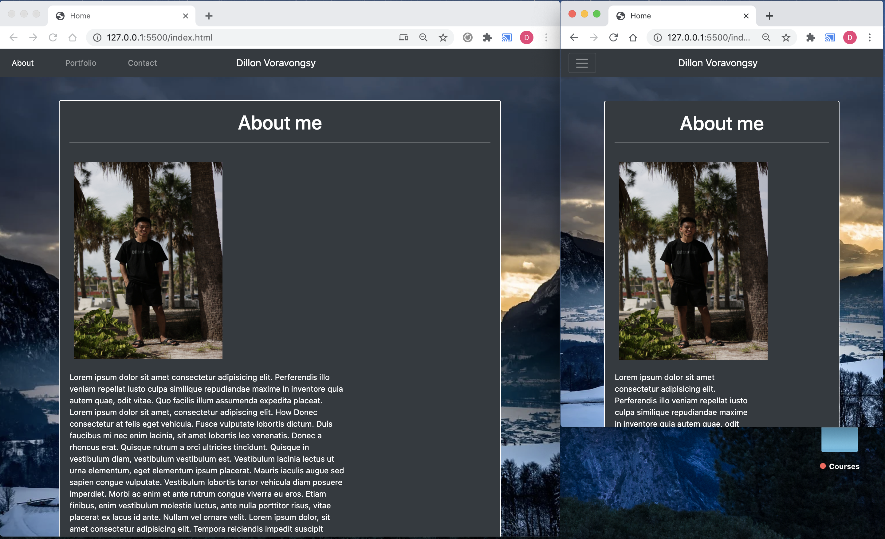
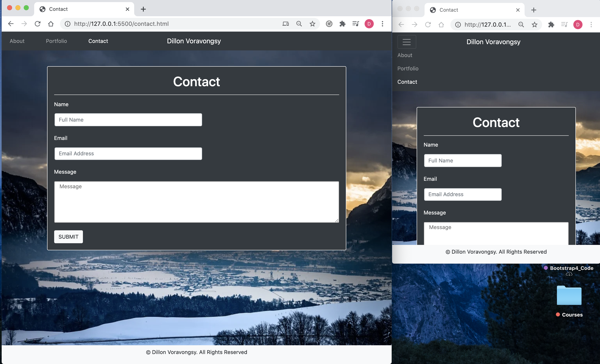

Here I am introducing my Portfolio page to you. There is very little information as I do not have anything to add on it, yet! The index.html page consist of a information on getting into contact with me, alond with profile links to my Github and LinkedIn. The portfolio.html consist of recent projects I have done, Introversion being based off of an application for those who have trouble being social with others. and the weather application showing you the forecast for whichever city you input. The contact.html is self-explantory, but is not functional. 

This image shows the index.html being responsive.

This image shows the contactMe.html being responsive.

This image shows the portfolio.html being responsive.

