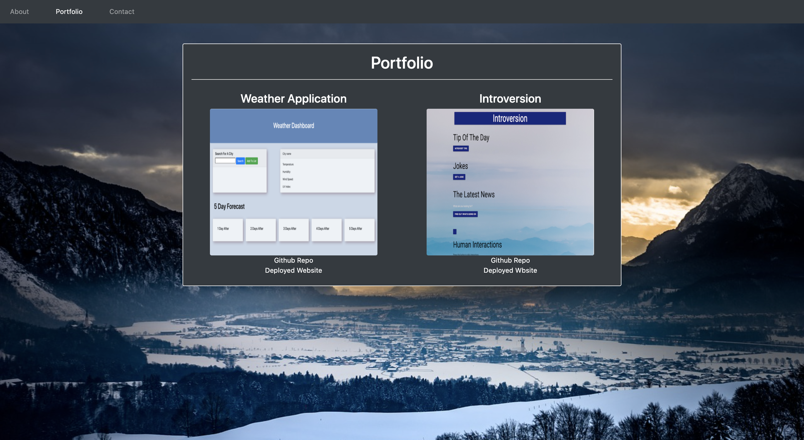

<<<<<<< HEAD
Here I am introducing my Portfolio page to you. There is very little information as I do not have anything to add on it, yet! The index.html page consist of a information on getting into contact with me, alond with profile links to my Github and LinkedIn. The portfolio.html consist of recent projects I have done, Introversion being based off of an application for those who have trouble being social with others. and the weather application showing you the forecast for whichever city you input. The contact.html is self-explantory, but is not functional. 
=======
Here I am introducing my Portfolio page to you. There is very little information as I do not have anything to add on it, yet! The index.html page consist of a article about who I am, and what I enjoy. The portfolio.html does not contain any projects at the moment, but does have pictures of me with my family and those I love. The contact.html is self-explantory, but is not functional. 
>>>>>>> b14db6d5bc397a843e2a862f485059621b7725f4

This image shows the index.html being responsive.

<<<<<<< HEAD

=======

>>>>>>> b14db6d5bc397a843e2a862f485059621b7725f4

This image shows the contactMe.html being responsive.

This image shows the portfolio.html being responsive.

<<<<<<< HEAD

=======

>>>>>>> b14db6d5bc397a843e2a862f485059621b7725f4
